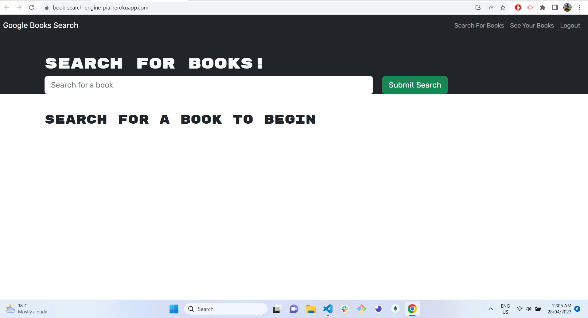

# Book Search Engine

Book Search Engine allow users to search for books, create an account and once logged in, save books, retrieved these books in a saved list and also remove books from list.

## Technology used

Book Search Engine app was refactored from RESTful API to GrapgQL API with Apollo server.

- JavaScript
- Node.js
- Express
- React
- Apollo server
- Graphql
- Mongodb Atlas
- Mongoose

# Link to deploy app

App deployed with Heroku

[Book-Search-Engine-Link](https://book-search-engine-pia.herokuapp.com/)

## Screenshot of deploy app

